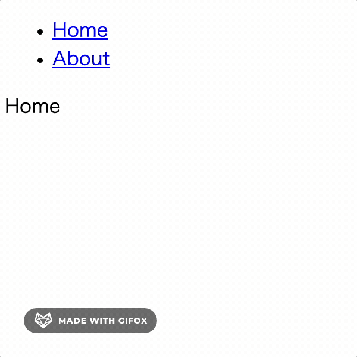
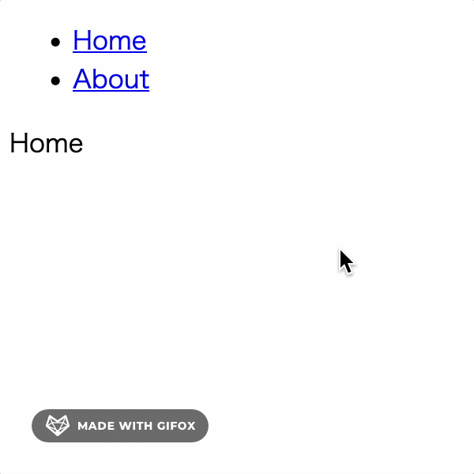

# ⏸️ react-view-transitions-sample

[View Transitions API](https://developer.mozilla.org/en-US/docs/Web/API/View_Transitions_API) を `react-router-dom` で組み合わせてみたサンプルプログラム。

View Transitions APIでページ遷移時にスタイルをあてることをしています。

## チェックポイント

- `src/modules/view-transitions/`
- `src/modules/view-transitions/TransitionLink.tsx`


## プレビュー

ChromeではView Transitions APIは動作するが、Firefox(v115時点)では動作しない。

ページ遷移時に背景を灰色にしています。また、遷移アニメーションは2秒に設定しています。

| Chrome v115               | Firefox v115               |
|---------------------------|----------------------------|
|  |  |


## 確認方法

```bash
npm install
npm run dev
```
